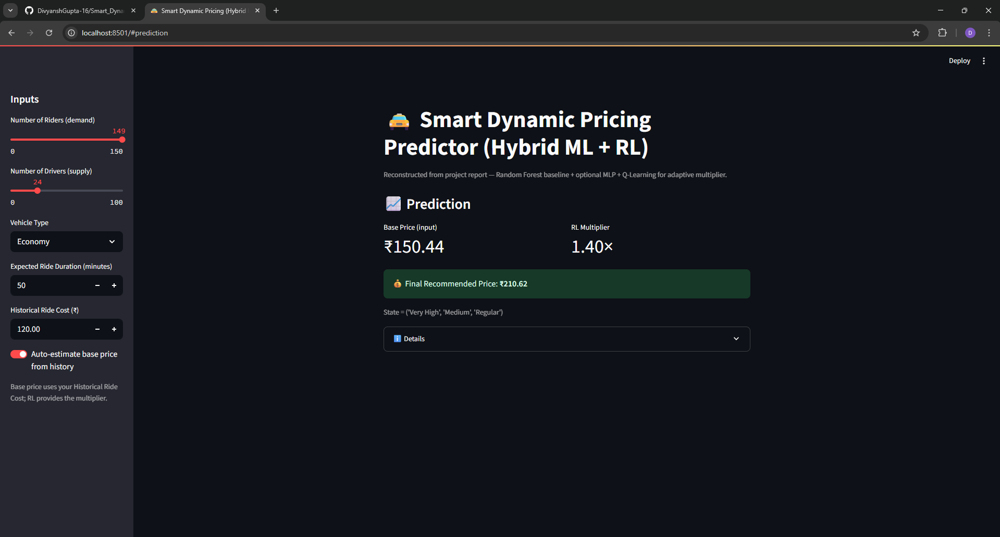

# 🚖 Smart Dynamic Pricing System

<div align="center">


**A hybrid Machine Learning + Reinforcement Learning system for dynamic ride pricing**

*Combining historical price estimation with Q-learning for adaptive pricing strategies*

[🚀 Quick Start](#-quick-start) • [📖 Documentation](#-documentation) • [🎯 Features](#-features) • [📊 Demo](#-demo)

</div>

---

## 🎯 Overview

This project implements an intelligent dynamic pricing system for ride-sharing services that combines:

- **📈 Machine Learning**: Historical price estimation using median-based algorithms
- **🤖 Reinforcement Learning**: Q-learning agent for optimal price multiplier selection
- **🎨 Interactive Interface**: Beautiful Streamlit web application for real-time predictions

The system adaptively adjusts ride prices based on demand, supply, vehicle type, and customer loyalty to maximize revenue while maintaining competitive pricing.

## ✨ Features

### 🧠 **Intelligent Base Price Estimation**
- **Hierarchical Fallback Strategy**: Duration window → Duration bins → Vehicle type → Global median
- **Robust Handling**: Works with sparse data and missing historical records
- **Multi-tier Support**: Economy, Premium, and Luxury vehicle pricing

### 🎯 **Advanced Feature Engineering**
- **Smart Bucketing**: Demand (Low/Medium/High/Very High) and Supply (Low/Medium/High) levels
- **Loyalty Mapping**: Vehicle type → Customer tier (Regular/Silver/Gold)
- **State Representation**: Optimized for reinforcement learning

### 🤖 **Q-Learning Agent**
- **Dynamic Environment**: Simulates real ride scenarios as episodes
- **Price Multipliers**: [0.8×, 1.0×, 1.2×, 1.4×] for flexible pricing
- **Reward Optimization**: Revenue maximization with cost consideration
- **Epsilon-Greedy**: Balanced exploration vs exploitation

### 🎨 **Interactive Web Application**
- **Real-time Predictions**: Instant price recommendations
- **Auto-estimation**: Optional historical price calculation
- **Visual Feedback**: Clear metrics and state information
- **Responsive Design**: Works on desktop and mobile

## 🚀 Quick Start

### Prerequisites
- Python 3.8 or higher
- pip package manager

### Installation

1. **Clone the repository**
   ```bash
   git clone https://github.com/your-username/dynamic-pricing-strategy.git
   cd dynamic-pricing-strategy
   ```

2. **Create virtual environment**
   ```bash
   # Windows
   python -m venv venv
   venv\Scripts\activate
   
   # macOS/Linux
   python3 -m venv venv
   source venv/bin/activate
   ```

3. **Install dependencies**
   ```bash
   pip install -r requirements.txt
   ```

4. **Run the application**
   ```bash
   streamlit run app.py
   ```

5. **Open your browser** to `http://localhost:8501`

## 📂 Project Structure

```
dynamic-pricing-strategy/
├── 📁 data/
│   └── dynamic_pricing.csv          # Historical ride data
├── 📁 src/
│   ├── base_price.py               # Base price estimation logic
│   ├── preprocessing.py            # Data preprocessing & state building
│   ├── rl.py                       # RL environment & Q-learning agent
│   └── utils.py                    # Feature engineering utilities
├── 📁 assets/
│   ├── base_price_1x.png          # Demo screenshots
│   ├── base_price_1-2x.png
│   ├── base_price_1-4x.png
│   └── estimated_base_price.png
├── app.py                          # Streamlit web application
├── requirements.txt                # Python dependencies
└── README.md                       # This file
```

## 📊 Demo

### 🖼️ Application Screenshots

<table>
<tr>
<td align="center">
<strong>Base Price Estimation</strong><br/>

</td>
<td align="center">
<strong>High Demand Scenario</strong><br/>

</td>
</tr>
<tr>
<td align="center">
<strong>Supply-Demand Imbalance</strong><br/>

</td>
<td align="center">
<strong>Duration-based Pricing</strong><br/>

</td>
</tr>
</table>

### 📈 Example Output

```
Base Price (ML Estimate): ₹120.00
RL Multiplier: 1.20×
State: ('High', 'Medium', 'Silver')
─────────────────────────────────
💰 Final Recommended Price: ₹144.00
```

## 🧠 Methodology

### 🔄 **Hybrid Approach**

1. **Machine Learning Component**
   - Analyzes historical ride data
   - Estimates base price using statistical methods
   - Handles missing data and edge cases

2. **Reinforcement Learning Component**
   - Q-learning agent learns optimal pricing strategies
   - Considers demand, supply, and customer loyalty
   - Maximizes revenue through dynamic multiplier selection

3. **Integration**
   - Final Price = Base Price × RL Multiplier
   - Real-time adaptation to market conditions

### 📊 **Data Requirements**

Your dataset should include these columns:
```csv
Number_of_Riders,Number_of_Drivers,Vehicle_Type,Expected_Ride_Duration,Historical_Cost_of_Ride
```

## 🛠️ Usage

### **Web Interface**
1. Adjust sliders for demand (riders) and supply (drivers)
2. Select vehicle type and expected duration
3. Choose between manual input or auto-estimation for base price
4. View real-time price recommendations

### **Programmatic Usage**
```python
from src.base_price import estimate_base_price
from src.rl import train_q_agent, DynamicPricingEnv
from src.preprocessing import load_data, preprocess

# Load and preprocess data
df = load_data("data/dynamic_pricing.csv")
processed_df = preprocess(df)

# Train RL agent
env = DynamicPricingEnv(processed_df)
agent = train_q_agent(env, episodes=25)

# Get price recommendation
base_price = estimate_base_price(df, "Premium", 30)
multiplier = agent.get_best_action(state)
final_price = base_price * multiplier
```

## 📋 Dependencies

- **streamlit** ≥ 1.33 - Web application framework
- **pandas** ≥ 2.0 - Data manipulation and analysis
- **numpy** ≥ 1.24 - Numerical computing

---

<div align="center">

**⭐ Star this repository if you found it helpful!**

[🔝 Back to Top](#-smart-dynamic-pricing-system)

</div>